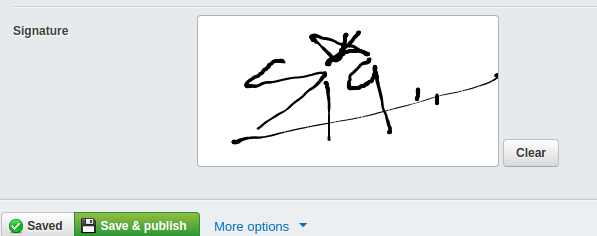

# silverstripe-signaturefield

## NOTE: the field is working fine as is, but I'm thinking of switching the saving to db as vector (svg) instead of png data because of size. Then the signature pad may be switched to [jquery signature pad](http://thomasjbradley.ca/lab/signature-pad/).

A silverstripe signature form field based on https://github.com/szimek/signature_pad



### Usage

A signaturefield will be scaffolded if field is set to 'Signature' (field holds base64 png image of signature)

```php
use Micschk\SignatureField\Signature;

class Contract extends DataObject {

	private static $db = array(
		'Signature' => Signature::class,
	);

}
```

Or explicitly add a SignatureField to a form (eg for non-scafolded formfields or front-end)

```php
use Micschk\SignatureField\SignatureField;

...

	public function getCMSFields() {
		$fields = parent::getCMSFields();

		$fields->addFieldToTab('Root.Main',
				SignatureField::create('Signature')
			);

		return $fields;
	}
```

## Development

The js is bundled using parcel.js. To make javascript changes

1. run `yarn install` to install dependencies.
2. make requisite changes in `javascript/src/signature_pad.init.js`
3. run `yarn build` to compile changes
